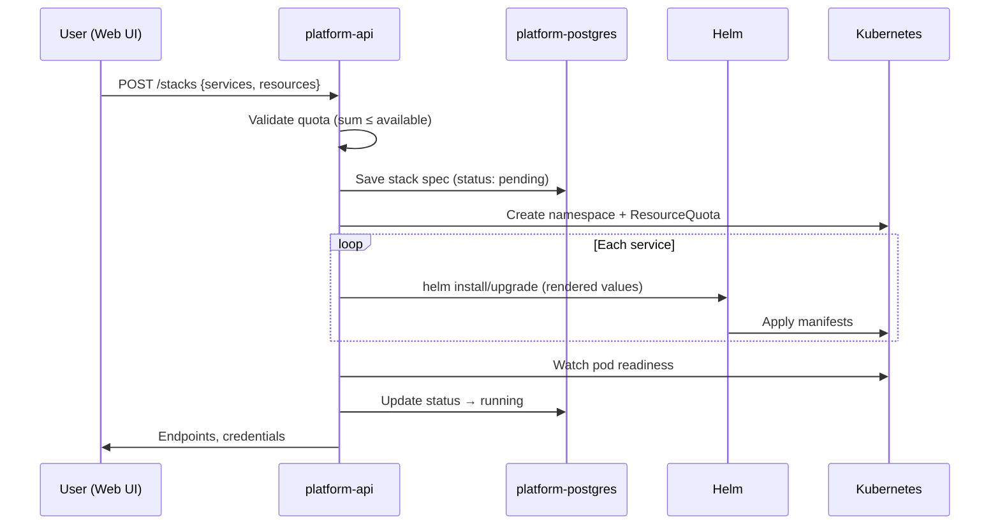

# Архитектура Cloud DWH Platform

## 1. Контекст

- **1 нода**: 128 GB RAM, 48 vCPU, Kubernetes
- **Цель**: self-service развёртывание DWH-сервисов через веб-UI
- **Референс**: существующий стек в `DWH_cluster` (Docker Compose)

## 2. Слои платформы

### 2.1 Platform Layer (namespace `platform`)

Фиксированная инфраструктура, не управляется пользователями.

| Компонент | Назначение | RAM | CPU |
|-----------|------------|-----|-----|
| nginx-ingress | Единая точка входа | 256M | 0.5 |
| cert-manager | TLS-сертификаты | 128M | 0.2 |
| local-path-provisioner | Локальные PVC | 64M | 0.1 |
| Altinity CH Operator | Управление ClickHouse | 512M | 0.5 |
| Strimzi Operator | Управление Kafka | 512M | 0.5 |
| CloudNativePG Operator | Управление Postgres | 256M | 0.3 |
| kube-prometheus-stack | Мониторинг | 2G | 1 |
| platform-api | Provisioning API | 512M | 1 |
| platform-ui | Web UI | 256M | 0.5 |
| platform-postgres | Метаданные стеков | 512M | 0.5 |
| platform-redis | Кэш API | 128M | 0.2 |
| **Итого** | | **~5 GB** | **~5** |

Резерв под OS/kubelet: ~7 GB RAM, ~1 CPU.

### 2.2 User Stack Layer (namespace `stack-{uuid}`)

Каждый стек — изолированный namespace с ResourceQuota.

```
stack-abc123/
├── clickhouse/          # ClickHouseInstallation CR
├── kafka/               # Kafka CR (Strimzi, KRaft)
├── postgres/            # Cluster CR (CloudNativePG)
├── redis/               # Bitnami Redis (Airflow + Superset)
├── airflow/             # Helm release
├── superset/            # Helm release
└── ingress/             # Маршруты *.stack-abc123.domain
```

## 3. Control Plane

### 3.1 Поток provisioning



### 3.2 API Endpoints

| Method | Path | Описание |
|--------|------|----------|
| GET | `/api/v1/services` | Каталог доступных сервисов и presets |
| GET | `/api/v1/quota` | Свободные ресурсы кластера |
| POST | `/api/v1/stacks` | Создать стек |
| GET | `/api/v1/stacks` | Список стеков |
| GET | `/api/v1/stacks/{id}` | Статус, endpoints |
| PATCH | `/api/v1/stacks/{id}` | Изменить ресурсы |
| DELETE | `/api/v1/stacks/{id}` | Удалить стек |

### 3.3 Модель ресурсов

```json
{
  "name": "analytics-prod",
  "services": {
    "clickhouse": {
      "enabled": true,
      "replicas": 2,
      "resources": {"cpu": "4", "memory": "16Gi", "storage": "100Gi"}
    },
    "kafka": {
      "enabled": true,
      "brokers": 1,
      "resources": {"cpu": "2", "memory": "4Gi", "storage": "20Gi"}
    },
    "postgres": {
      "enabled": true,
      "resources": {"cpu": "1", "memory": "2Gi", "storage": "10Gi"}
    },
    "airflow": {
      "enabled": true,
      "executor": "CeleryExecutor",
      "workers": 2,
      "resources": {"cpu": "4", "memory": "8Gi"}
    },
    "superset": {
      "enabled": true,
      "resources": {"cpu": "2", "memory": "4Gi"}
    }
  }
}
```

## 4. Сервисы и зависимости

```
                    ┌─────────────┐
                    │  Superset   │──┐
                    └──────┬──────┘  │
                           │         │ Postgres (metadata)
                    ┌──────▼──────┐  │
                    │   Airflow   │──┤
                    └──────┬──────┘  │
                           │         │
              ┌────────────┼─────────┘
              │            │
       ┌──────▼──────┐ ┌───▼────┐ ┌──────────┐
       │    Redis    │ │Postgres│ │ClickHouse│
       └─────────────┘ └────────┘ └────┬─────┘
                                         │
                                    ┌────▼────┐
                                    │  Kafka  │
                                    └─────────┘
```

**Автоматические зависимости** (platform-api добавляет при включении сервиса):

| Если включён | Автоматически добавляется |
|--------------|---------------------------|
| Airflow | Postgres, Redis |
| Superset | Postgres, Redis |
| Kafka Connect | Kafka, Schema Registry |

## 5. Хранение данных

На single-node используем **local-path-provisioner** (Rancher):

- PVC привязаны к ноде
- Рекомендуется отдельный диск/NVMe под `/var/lib/rancher/k3s/storage`
- Backup: clickhouse-backup CronJob → S3/MinIO, pg_dump для Postgres

## 6. Сеть и доступ

```
*.dwh.local/
├── stack-abc123-airflow.dwh.local   → Airflow UI
├── stack-abc123-superset.dwh.local  → Superset
├── stack-abc123-kafka-ui.dwh.local  → Kafka UI
└── platform.dwh.local               → Platform UI
```

Ingress annotations: `cert-manager.io/cluster-issuer: selfsigned`

## 7. Безопасность

- **Изоляция**: namespace + NetworkPolicy (deny cross-stack)
- **Секреты**: External Secrets или Kubernetes Secrets (генерируются API)
- **RBAC**: ServiceAccount на стек, platform-api — cluster-admin для Helm
- **Аутентификация UI**: Keycloak (Phase 2) или basic auth (MVP)

## 8. Presets ресурсов

| Preset | RAM | CPU | Описание |
|--------|-----|-----|----------|
| `minimal` | 32 GB | 12 | Dev: 1 CH, 1 Kafka, AF+SS |
| `standard` | 64 GB | 24 | 2 CH, 1 Kafka, 2 AF workers |
| `full` | 96 GB | 36 | 4 CH, 3 Kafka, полный стек |

## 9. Ограничения single-node

1. **Нет HA** — отказ ноды = отказ всего
2. **1 активный full-stack** одновременно (или 2-3 minimal)
3. Kafka: KRaft с 1 broker (не 3) для экономии ресурсов
4. ClickHouse: 1-2 реплики вместо 4-node cluster
5. Мониторинг обязателен — алерты на memory/disk pressure

## 10. Roadmap

| Phase | Scope |
|-------|-------|
| **MVP** | Bootstrap + API + UI + 1 сервис (Postgres) |
| **Alpha** | Все 5 сервисов, presets, quota validation |
| **Beta** | Backup, monitoring dashboards, DAG git-sync |
| **Prod** | Keycloak SSO, multi-user, S3 backup |
